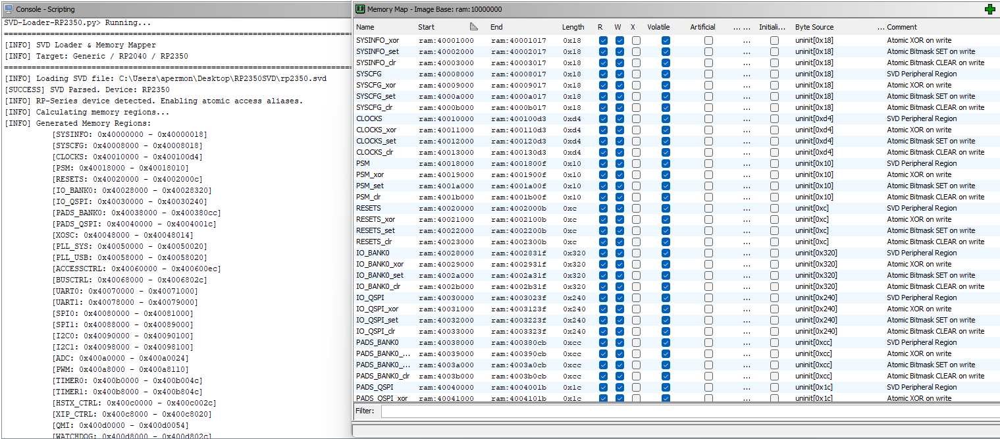

# RP2350 SVD Loader for Ghidra

## Introduction to SVD Files

System View Description (SVD) files are XML-based documents that contain a detailed description of a microcontroller's peripheral registers. They define memory addresses, register offsets, bitfields, and reset values. In reverse engineering, these files are essential for mapping the raw memory space of a binary into human-readable peripheral names, transforming anonymous memory accesses into identified hardware interactions.

## Project Overview

This script is a SVD loader for the RP2350 (Pico 2) adapted for PyGhidra. It automates the creation of memory segments and register definitions based on the official SVD specifications. 

This version has been developed based on the previous work found in the following repositories:

- [https://github.com/wejn/SVD-Loader-Ghidra-RP2040/tree/master](https://github.com/wejn/SVD-Loader-Ghidra-RP2040/tree/master)
- [https://github.com/leveldown-security/SVD-Loader-Ghidra](https://github.com/leveldown-security/SVD-Loader-Ghidra)

## Installation

1. Download this repository or the `SVD-Loader-RP2350.py` file directly.

```bash
git clone https://github.com/b1n4ri0/SVD-Loader-PyGhidra-RP2350.git 
```

2. Copy the script file into the `ghidra_scripts` directory of your Ghidra installation.

```bash
cd SVD-Loader-PyGhidra-RP2350

cp SVD-Loader-RP2350.py $GHIDRA_INSTALL_DIR/Ghidra/Features/PyGhidra/ghidra_scripts
```

## Usage

1. Import the target `.bin`  file into Ghidra.
2. Open the file in the `CodeBrowser`.
3. When prompted to perform auto-analysis, select `No`. 
4. Open the Script Manager, `Window > Script Manager` .
5. Search for `SVD-Loader-RP2350.py` within the `RP2350` category.
6. Execute the script.
7. Select the RP2350 SVD file (link provided in the Resources section below).
8. After the script finishes creating memory blocks and labels, analyze the binary pressing `A`.

## Example




## Resources

- Official RP2350 SVD file: [https://github.com/raspberrypi/pico-sdk/blob/master/src/rp2350/hardware_regs/RP2350.svd](https://github.com/raspberrypi/pico-sdk/blob/master/src/rp2350/hardware_regs/RP2350.svd)
- CMSIS-SVD Data Repository: [https://github.com/cmsis-svd/cmsis-svd-data](https://github.com/cmsis-svd/cmsis-svd-data)